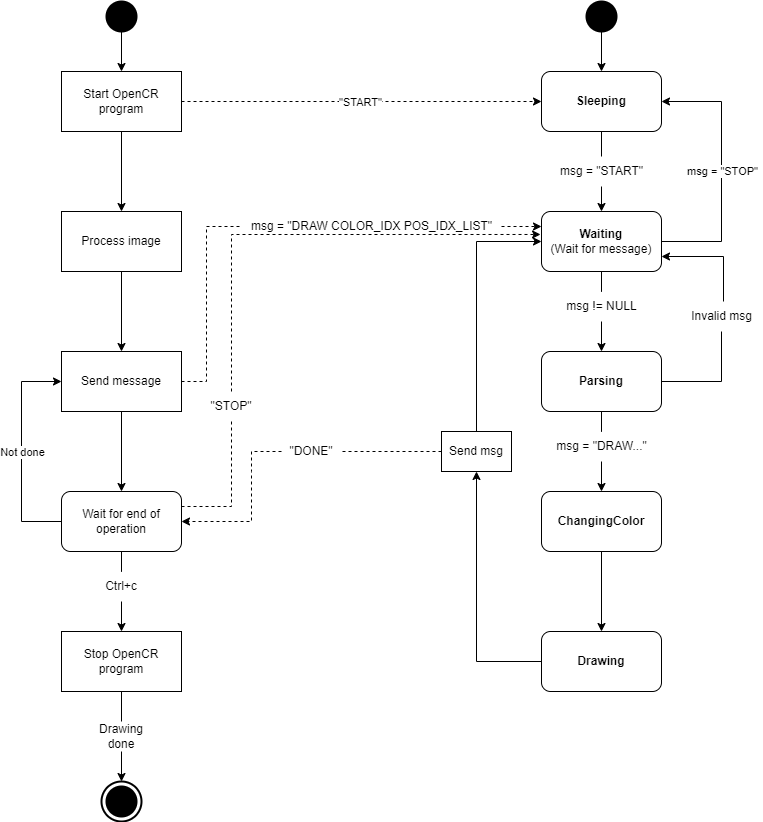

# Fichier Code_OpenCR

Ce fichier contient toutes les fonctions en C++ qui s'exécutent sur la carte OpenCR.

## Fichiers

- __actuators.cpp__ : Ce fichier contient toutes les fonctions qui controllent les différents actuateurs du projet POLUS.
- __inverseKinematics.cpp__ : Ce fichier reçoit en entré une valeur cartésienne (X,Y) et retourne deux angles pour les moteurs du bras scara.
- __Code_OpenCR.ino__ : Ce fichier est le fichier "main" s'exécutant sur la carte OpenCR.
-__serialcomm_functions.cpp__: Permet de lire des données depuis un port série, les diviser en parties distinctes et appeler la fonction correspondante en fonction du type de message envoyé.

## Diagramme d'état du code

L'image suivante démontre la relation entre le code s'exécutant sur le Raspberry Pie et la carte OpenCR.

