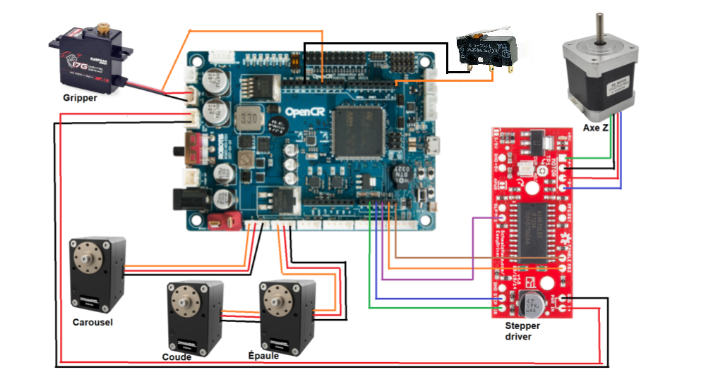

# POLUS

## Table des matières
* [Requis matériels](#requis-matériels)
* [Assemblage](#assemblage)
* [Requis logiciels](#requis-logiciels)
* [Installation](#installation)
* [Exécuter le programme](#exécuter-le-programme)
* [License](#license)

## Requis matériels
### Impression 3D
Sur une imprimante 3D avec une capacité d'au moins 250 x 250 x 200mm, imprimer tous les fichiers dans le dossier ([STLs](https://github.com/alicegarceau/POLUS/tree/main/V1_STLs))

### Autres composants mécaniques
- [ ] 1 x Paquet de crayons feutres ([Amazon](https://www.amazon.ca/-/fr/dp/B01LXRJKVY?psc=1&))
- [ ] 2 x Vis M6 x 1 à épaulement de 8 x 55mm ([McMaster-Carr](https://www.mcmaster.com/92981A210/))
- [ ] 2 x Écrous M6
- [ ] 4 x Rondelles M6
- [ ] 1 x Coupleur flexible 5mm à 8mm ([Amazon](https://www.amazon.ca/AFUNTA-Flexible-Couplings-Compatible-Machines/dp/B07JL1QYLS/))
- [ ] 1 x Vis ACME Tr8 x 8mm x 300mm et écrou ([Amazon](https://www.amazon.ca/dp/B08JQ4H6M9?_encoding=UTF8&psc=1&))
- [ ] 3 x Roulements à billes linéaires LM8UU ([Amazon](https://www.amazon.ca/uxcell%C2%AE-Bushing-Linear-Motion-Double/dp/B00X9H22SO/))
- [ ] 4 x Roulements à billes à épaulement 608 ([McMaster-Carr](https://www.mcmaster.com/57155K513/))
- [ ] 26 x Inserts filetés M3 pour plastique ([McMaster-Carr](https://www.mcmaster.com/94180A333/))
- [ ] 32 x Vis SHCS M3 x 14mm
- [ ] 12 x Vis SHCS M2.5 x 6mm
- [ ] 1 x Feuille de contre-plaqué 480 x 480mm
- [ ] 6 x Attaches de plastique (Tyrap) 3 x 100mm min

### Composants électriques
- [ ] 1 x Fil micro-USB de 0.3m
- [ ] 1 x Microcontrôleur OpenCR 1.0 
- [ ] 2 x Servomoteurs Dynamixel XM430-W350
- [ ] 1 x Servomoteur Dynamixel XL430-W250
- [ ] 2 x Servomoteur de type "hobby" Hitech HS-422
- [ ] 1 x Moteur pas-à-pas NEMA17 ([Amazon](https://www.amazon.ca/dp/B06ZYQNBFR?))
- [ ] 1 x Contrôleur de moteur pas-à-pas ([EasyDriver](https://www.sparkfun.com/products/12779))
- [ ] 2 x Interrupteur de fin de course miniature

## Assemblage
### Assemblage électrique

### Assemblage mécanique
Installer les inserts filetés avec un fer à souder à environ 300 deg C dans toutes les pièces qui doivent en recevoir.

[!!! Enrick : Insérer vues explosées des sections du robot]

#### Avant-bras et pince

#### Bras et épaule (plateforme mobile en Z)

#### Base

#### Carousel

## Requis logiciels
* Arduino IDE version 2 ([arduino](https://www.arduino.cc/en/software))
* Paquet Open-CR du Boards Manager : suivre les instructions d'installation pour Windows ([opencr](https://emanual.robotis.com/docs/en/parts/controller/opencr10/#install-on-windows))

### Fichiers de code du OpenCR
Le dossier Code_OpenCR contient toutes les fonctions en C++ qui s'exécutent sur la carte OpenCR.
- __actuators.cpp__ : Ce fichier contient les fonctions qui controllent les actuateurs du projet POLUS, sauf le moteur pas à pas de l'axe Z.
- __stepperZ.cpp__ : Ce fichier contient les fonctions qui controllent le moteur pas à pas de l'axe Z. 
- __inverseKinematics.cpp__ : Ce fichier reçoit en entré une valeur cartésienne (X,Y) et retourne deux angles pour les moteurs du bras scara.
- __serialcomm_functions.cpp__: Permet de lire des données depuis un port série, les diviser en parties distinctes et appeler la fonction correspondante en fonction du type de message envoyé.
- __Code_OpenCR.ino__ : Ce fichier est le fichier "main" s'exécutant sur la carte OpenCR.

### Diagramme d'état du code

L'image suivante démontre la relation entre le code s'exécutant sur l'ordinateur (interface utilisateur) et la carte OpenCR.

## Installation

Sur un PC Windows :
* Ouvrir le fichier Code_OpenCR.ino dans Arduino IDE et brancher la carte OpenCR à l'ordinateur. Dans Arduino IDE, sélectionner le "board" OpenCR et téléverser le code.
* Brancher la carte OpenCR à votre ordinateur avec un fil micro-USB
* Installer les librairies suivantes avec pip:
  * Python:  
    pyserial  
    [!!! Alice : à compléter]

## Exécuter le programme
[!!! Alice : Insérer captures d'écran du UI avec un example pour une image]

- Choisir le port USB pour établir la liaison série avec le OpenCR

## License
Apache Version 2.0

Voir [LICENSE](LICENSE)
